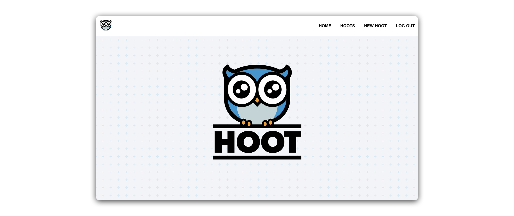
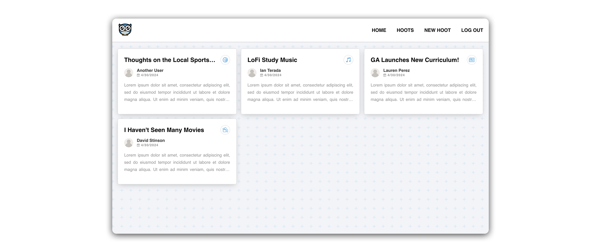
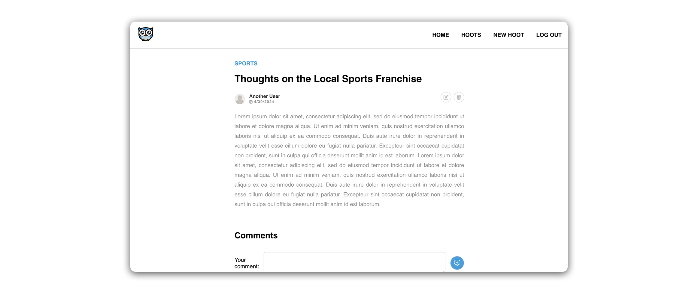
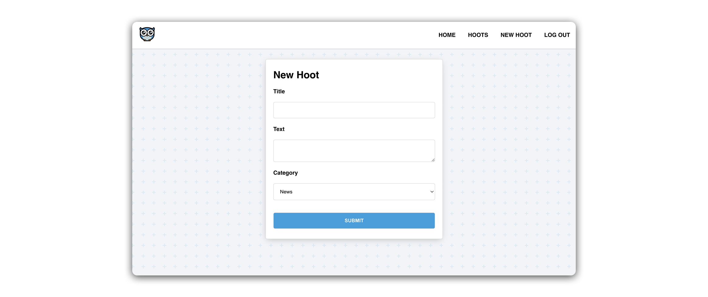
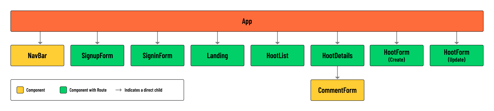

# Hoot Front-End - Setting the Stage

## What we’re building - Hoot: Blogging for night owls

In this module, we will create a front-end blogging application using React and JWT Authentication. Pairing this front-end app with an Express API back-end and MongoDB database will yield a complete **MERN** Stack application.

JWT Authentication has already been implemented, allowing users to sign up, sign in, and sign out of our application.

Users with an account will be able to create, read, update, and delete blog posts. For branding purposes, we’ll refer to these blog posts as ‘hoots’. Additionally, signed-in users will be able to create and read comments associated with a specific hoot.

In building this application, you’ll get hands-on experience with several patterns fundamental to React, including client-side routing with the React Router library, dynamically rendering content based on permissions, and implementing reusable components.

Take a look at the screenshots below for a sense of the core components that will go into this application:

> 🚀 The screenshots above depict the application after completing all styling in the Level Up lessons.

## User stories
Below are the user stories we will implement within Hoot:

- As a guest, I should be able to create an account.
- As a new user with an account, I should be able to log in to my account.
- As a user, I should be able to create a hoot post.
- As a user, I should be able to see a list of all hoots on a ‘List’ page.
- As a user, clicking on a hoot in the ‘List’ page should navigate me to a hoot’s ‘Details’ page to view information about a single hoot post and its associated comments.
- As a user, I should be able to add a comment on a hoot’s ‘Details’ page.
- As the author of a hoot, I should see a link to ‘Edit’ a hoot on the ‘Details’ page. Clicking on the link should direct me to an ‘Edit’ page where I can modify the hoot. Upon submitting the update, I should be redirected back to the ‘Details’ page.
- As the author of a hoot, I should see a button to ‘Delete’ a hoot on the ‘Details’ page. Clicking the button should delete the hoot and redirect me back to the ‘List’ page.

>💡 The above user stories give us a good idea of what CRUD operations a user might want to perform in our app.

## Component hierarchy diagram
After reviewing the user stories, our next step is to map out the component structure of our React app. For this, we’ll utilize a **Component Hierarchy Diagram**. This visual tool will act as an outline of the tree structure in our client-side app.

Below is the component hierarchy diagram for the MVP build of Hoot:

> 💡 Notice how most of our components will require a client-side route. This is because we treat these components as distinct pages in our app. Components not marked as requiring a route will be used as subcomponents making up the UI of a page.

