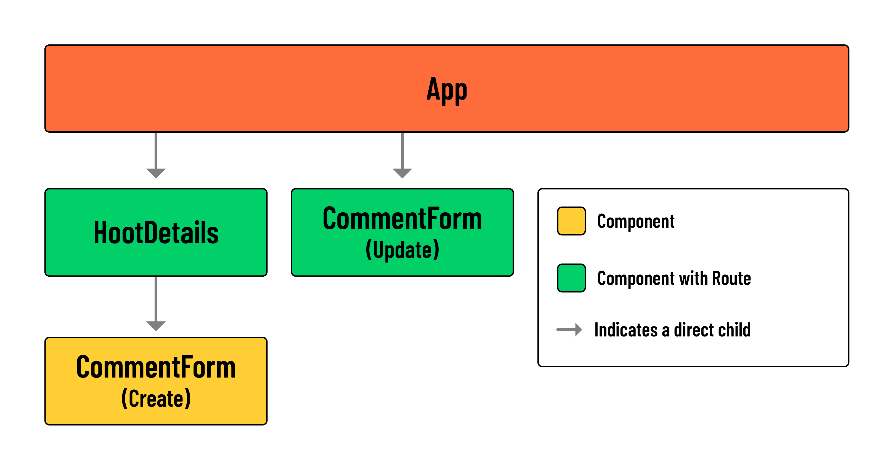

# Hoot Front-End - Update and Delete Comments

## Overview
In this lesson, we’ll add the functionality for updating and deleting comments. We’ll task you with implementing the solution for a few portions of this lesson. This will act as a great opportunity to reinforce your understanding of React. But don’t worry; much of the code you’ll write will mirror patterns seen elsewhere in this application. Be sure to reference the relevant lessons when necessary.

> 🚨 Note: This lesson assumes that you have completed the steps for updating and deleting comments within your back-end API.

## Deleting Comments
Start by implementing the functionality for deleting a comment. This should be a bit easier than handling updates. It will also provide you with several pieces of code that can apply to updates.

### 🎓 You Do: Add the ‘Delete’ `<button>` for comments
The first step is addressing the UI elements that will trigger the request. In the case of deleting comments, this means adding a ‘Delete’ `<button>` to each comment in the `HootDetails` component.

Take a look at the code used to render ‘Edit’ and ‘Delete’ elements for a `hoot`:

```jsx
// src/components/HootDetails/HootDetails.jsx

        {hoot.author._id === user._id && (
          <>
            <Link to={`/hoots/${hootId}/edit`}>Edit</Link>

            <button onClick={() => props.handleDeleteHoot(hootId)}>
              Delete
            </button>
          </>
        )}
```

You’ll want to mimic this approach for deleting and updating comments.

Take a look at the code block below for reference on where these elements should be placed:

```jsx
// src/components/HootDetails/HootDetails.jsx

        {hoot.comments.map((comment) => (
          <article key={comment._id}>
            <header>
              <p>
                {`${comment.author.username} posted on
                ${new Date(comment.createdAt).toLocaleDateString()}`}
              </p>
              {/* Add the edit and delete UI here */}
            </header>
            <p>{comment.text}</p>
          </article>
        ))}
```
> 🏆 Be sure to include conditional rendering based on the authorship of a comment!

### 🎓 You Do: Build the `handleDeleteComment()` function
Next, you’ll want to add a `handleDeleteComment()` function to the HootDetails component.

The function should accept a `commentId`, call a `deleteComment()` service function, and filter `hoot` state accordingly. Don’t worry about the `deleteComment()` service function for now; we’ll address that in the next step.

1. Start by building the scaffolding for the function, updating the ‘Delete’ button’s event handler, and confirming that you have access to the `commentId` within `handleDeleteComment`:

    ```jsx
    // src/components/HootDetails/HootDetails.jsx

    const handleDeleteComment = async (commentId) => {
        console.log('commentId:', commentId);
    };
    ```

2. With access to the commentId, you should be able to filter() local state:

    ```jsx
    // src/components/HootDetails/HootDetails.jsx

    const handleDeleteComment = async (commentId) => {
        console.log('commentId:', commentId);
        // Eventually, the service function will be called here
        setHoot({
        ...hoot,
        comments: hoot.comments.filter((comment) => comment._id !== commentId),
        });
    };
    ```
    > 🚨 Remember, we’ll eventually need to update our database for these changes to persist!

## 🎓 You Do: Build the service function
Next, add a `deleteComment()` service function `to src/services/hootService.js`. Like `createComment()`, the `deleteComment()` function will utilize the same `BASE_URL` as other hoot and comment related services.

The service function should accept both a `hootId` and a `commentId`. Use previous service functions as a reference to help you build this out.

```jsx
// src/services/hootService.js

const deleteComment = async (hootId, commentId) => {
  // You've got this!
};
```
> 💡 Check your back-end routes if you have trouble with this step. Based on the structure of previous service functions, making a request to `${BASE_URL}/${hootId}/comments/${commentId}` would be appropriate.

### 🎓 You Do: Call the service
With the service in place, return to the HootDetails component to finish up your handleDeleteComment() function.

```jsx
// src/components/HootDetails/HootDetails.jsx

  const handleDeleteComment = async (commentId) => {
    console.log('commentId:', commentId);
    // call  hootService.deleteComment here!
    setHoot({
      ...hoot,
      comments: hoot.comments.filter((comment) => comment._id !== commentId),
    });
  };
```
> 💡 When calling `hootService.deleteComment()`, remember to pass in `hootId` and `commentId`.

After completing this step you should be able to delete comments! 🎉

## Updating comments
The functionality for updating comments will mirror that of updating hoots quite closely. Be sure to review that lesson before moving on.

As we saw with updating hoots, the same form component can be used to create and update a resource. We’ll take the same approach with our `CommentForm` component.

Take a look at the diagram below for context on how the `CommentForm` used to update comments will fit into our component tree:



> 💡 Notice how one instance of `CommentForm` is treated as a standard child component while the other is treated as a ‘page’ with its own route.

### 🎓 You Do: Add the ‘Edit’ `<Link>` for comments
As always, start with the UI element.

In the `HootDetails` component, add an ‘Edit’ `<Link>` that directs a user to the ‘Edit Comment’ page. The `<Link>` should be placed directly above the ‘Delete’ comment `<button>`.

The `to` prop of your `<Link>` should have the following value:

```jsx
`/hoots/${hootId}/comments/${comment._id}/edit`;
```

After you add the `<Link>`, head to the `App` component and build the **corresponding client-side route**.

1. Remember to import the component inside `src/App.jsx`:

    ```jsx
    // src/App.jsx

    import CommentForm from './components/CommentForm/CommentForm';
    ```

2. And add a new protected route:

    ```jsx
    // src/App.jsx

    <Route
    path='/hoots/:hootId/comments/:commentId/edit'
    element={<CommentForm />}
    />
    ```
    > 💡 Notice the inclusion of `:hootId` and `:commentId`. These parameters will be necessary for the next step.

In the next section, we’ll access the value of this `hootId` parameter with the `useParams()` hook.

## Modify the `CommentForm`
Next, we’ll need to modify the `CommentForm` component so that it can be used in two different contexts (creating comments and updating comments).

1. Import `useParams` and `useNavigate` from `react-router` in the `CommentForm` component:

    ```jsx
    // src/components/CommentForm/CommentForm.jsx

    import { useParams, useNavigate } from 'react-router';
    ```

2. Within the component, call `useParams()` to access the `hootId` and the `commentId`:

    ```jsx
    // src/components/HootForm/CommentForm.jsx

    const { hootId, commentId } = useParams();
    console.log(hootId, commentId);
    ```

3. With a `console.log()`, verify that you can access the parameters using the new `Edit` link.

### Set `formData` state
Next, we’ll use the parameters from the step above to fetch the necessary data for `formData` state.

Our back-end does not have a dedicated controller for retrieving a specific comment, but the existing `show` functionality for hoots should work well in this scenario.

Within a `useEffect`, we can call `hootService.show()`. The `hoot` object issued as a response will contain the comment we need, which can be located by calling the `find()` method on `hoot.comments`. The resulting comment data can be stored in `formData` state.

1. Add imports for hootService and useEffect in the CommentForm component:

    ```jsx
    // src/components/CommentForm/CommentForm.jsx

    import { useState, useEffect } from 'react';
    import { useParams, useNavigate } from 'react-router';

    import * as hootService from '../../services/hootService';
    ```

2. Add the following `useEffect()`:

    ```jsx
    // src/components/CommentForm/CommentForm.jsx

    useEffect(() => {
        const fetchHoot = async () => {
            const hootData = await hootService.show(hootId);
            // Find comment in fetched hoot data
            setFormData(hootData.comments.find((comment) => comment._id === commentId));
        };
        if (hootId && commentId) fetchHoot();
    }, [hootId, commentId]);
    ```
    > 💡 Note the above `if` condition and inclusion of `hootId` and `commentId` in our effect’s dependency array. Our effect will only call `fetchHoot` if both of these pieces of data are present. Otherwise, we can assume the component is being used to create a brand new comment, in which case `formData` state should maintain its initial value.

3. Take a moment to confirm that the initial state of `formData` is correctly set editing a comment.

### Build the service function
Next, we’ll build the `updateComment()` service function.

Our `updateComment()` service function will accept three parameters:
- `hootId` to locate the parent document.
- `commentId` to locate the embedded subdocument.
- `commentFormData` to update the properties of the embedded subdocument.

Add the following to `src/services/hootService.js`:

```jsx
// src/services/hootService.js

const updateComment = async (hootId, commentId, commentFormData) => {
  try {
    const res = await fetch(`${BASE_URL}/${hootId}/comments/${commentId}`, {
      method: 'PUT',
      headers: {
        Authorization: `Bearer ${localStorage.getItem('token')}`,
        'Content-Type': 'application/json',
      },
      body: JSON.stringify(commentFormData),
    });
    return res.json();
  } catch (error) {
    console.log(error);
  }
};

export {
  index,
  show,
  create,
  createComment,
  deleteHoot,
  update,
  deleteComment,
  // export
  updateComment,
};
```

### Call the service
This function handles both adding and updating comments, so we’ll need an `if...else` block to decide which action to take:

- The `if` condition should check if both `hootId` and `commentId` are present:
    - If both are available, call `hootService.updateComment` to update the comment and `navigate()` to redirect the user back to `/hoots/${hootId}`.
    - If either `hootId` or `commentId` is missing, call `props.handleAddComment(formData)` to add a new comment without redirecting.

When a comment is updated, the user is redirected to the hoot’s ‘Details’ page. This triggers the `hootService.show(hootId)` function to run again, updating the state with the latest data from the back-end.

Because of this automatic state update, **you don’t need to manually update the state when a comment is edited**. Additionally, the `updateComment()` service can be called directly inside the `handleSubmit()` function in the `CommentForm` component.

1. First, let’s import the `useNavigate()` hook from `react-router`. This will allow us to redirect a user back to the `hootDetails` page. Within the component, add:

    ```jsx
    // src/components/HootForm/CommentForm.jsx

    const navigate = useNavigate();
    ```

2. In the `CommentForm` component, update the `handleSubmit()` function with the following:

    ```jsx
    // src/components/CommentForm/CommentForm.jsx

    const handleSubmit = (evt) => {
    evt.preventDefault();
    if (hootId && commentId) {
        hootService.updateComment(hootId, commentId, formData);
        navigate(`/hoots/${hootId}`);
    } else {
        props.handleAddComment(formData);
    }
    setFormData({ text: '' });
    };
    ```

You should now be able to update comments!