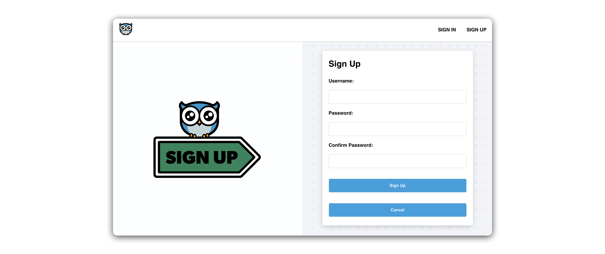
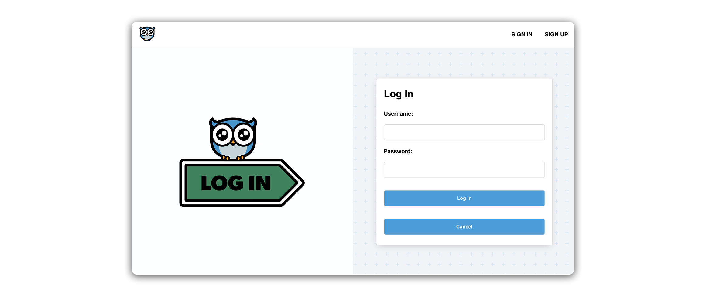

# Hoot Front-End - Style the Sign-up and Sign-In Pages

## Style the `SignUpForm` component



Let’s add some styling to our `SignUpForm`!

The `SignUpForm` and `SignInForm` pose an interesting design challenge. Generally, the elements of these forms are arranged in a narrow column, which is great for mobile devices, but can result in a lot of unused space on desktop screens.

To address this, we’ll modify our desktop layout by incorporating a large graphic alongside our `SignUpForm` and `SignInForm`. This will help us utilize the horizontal space more effectively. To maintain a clean and functional design on mobile devices, we’ll employ media queries to hide the graphic on smaller screens. This will ensure that our forms are visually appealing and space-efficient across different devices.

### Refactor `SignUpForm`
Before we add styling to The `SignUpForm` component, we’ll need to make a few changes to its JSX structure. This will help facilitate a specific `flex` layout we are working towards.

Take a look at the current structure of `src/components/SignUpForm/SignUpForm.jsx`:

```js
<main>
  <h1></h1>
  <p></p>
  <form>...</form>
</main>
```

Notice how we have a single container - `<main>`, with several child elements inside it. If we restrict ourselves to flexbox, these child elements can be generally arranged in a column or row.

In our desired layout, we want two distinct sections of the page, side by side one another in a row:

```js
<main>
  <section>
    
  </section>
  <section>
    <form>...</form>
  </section>
</main>
```

On the right-hand side of the screen, we’ll display our sign-up form component, while on the left, we’ll display a decorative image directing the user to sign up with the form.

Let’s take this step by step.

First, move the `<h1>` and `<p>` tags inside the `<form>` like so:

```jsx
// src/components/SignUpForm/SignUpForm.jsx

<form onSubmit={handleSubmit}>
  <h1>Sign Up</h1>
  <p>{message}</p>
```

Next, wrap the `<form>` in a `<section>` tag

```jsx
// src/components/SignUpForm/SignUpForm.jsx

<section>
  <form onSubmit={handleSubmit}>
```

At the top of the `SignUpForm` component, import the `SignUpIcon` SVG file:

```jsx
// src/components/SignUpForm/SignUpForm.jsx

import SignUpIcon from '../../assets/images/signup.svg';
```

Next, add the following `<section>` and `` tag. The `<section>` should be placed inside `<main>`, **directly above** the `<section>` containing the `<form>`:

```jsx
// src/components/SignUpForm/SignUpForm.jsx

<main>
  <section>
    
  </section>
```

Now, we have two distinct elements that can sit side by side within their shared parent container, which is a perfect setup for the `flex` layout we will be applying in the next step.

### Add the module
Run the following command in your terminal:

```bash
touch src/components/SignUpForm/SignUpForm.module.css
```

Add the following to the new file:

```css
/* src/components/SignUpForm/SignUpForm.module.css */

.container {
  height: 100%;
  display: flex;
  align-items: center;
}

.container p {
  margin: 0;
  padding: 0px 0 10px;
}

.container img {
  width: 65%;
  max-width: 500px;
}

.container section {
  width: 50%;
  height: 100%;
  display: flex;
  padding: 28px 21px;
  align-items: center;
  flex-direction: column;
}

.container section:first-child {
  height: 100%;
  align-items: center;
  justify-content: center;
  background-color: #fdfeff;
}

.container section:nth-child(2) {
  overflow: scroll;
  justify-content: center;
}

.container input {
  margin: 7px 0px 14px 0px;
}

.container input,
button {
  width: 100%;
  padding: 14px;
  font-size: 14px;
  border-radius: 5px;
  border: 1px solid rgb(220, 220, 220);
}

.container div {
  width: 100%;
  display: flex;
  flex-direction: column;
}

.container label {
  font-weight: 600;
  margin: 7px 0px 14px 0px;
}

.container button {
  color: white;
  font-weight: 600;
  background: #00a0df;
  margin: 21px 0px 0px 0px;
}

.container a {
  border: none;
  font-size: 14px;
  background: none;
  font-weight: 500;
  margin-top: 14px;
  text-align: center;
  color: rgb(200, 200, 200);
}

input:focus {
  outline: none;
  border: 1px solid #00a0df;
}

@media only screen and (max-width: 912px) {
  .container section {
    width: 100%;
  }
  .container section:first-child {
    display: none;
  }
  .container form {
    min-width: 100%;
  }
}

@media only screen and (max-height: 900px) {
  .container section:nth-child(2) {
    justify-content: flex-start;
  }
}
```

The above stylesheet gives us a two-column layout on desktop and, through media queries, a single-column layout on mobile. When we switch to a mobile layout (`max-width: 912px`), we apply `display: none`; to the left-side `section` containing our graphic. This effectively removes the image from our layout when it is no longer necessary as a placeholder.

We also have some interesting CSS selectors here with `:first-child` and `:nth-child(2)`.

The `.container section:first-child` selector targets the first section that is a direct child of `.container` class, while the `.container section:nth-child(2)` selector targets the second `section` child of `.container`.

This is just a way of applying variations to the left and right sections of the page without additional class names.

You might also notice the use of `overflow: scroll`. This grants our form section a scrollable overflow. This can be useful when a UI element with a set width or height might contain **more content than can be displayed within the available area**.

## Apply styles
Add the following import to `src/components/SignUpForm/SignUpForm.jsx`:

```jsx
// src/components/SignUpForm/SignUpForm.jsx

import styles from './SignUpForm.module.css';
```

And apply `styles.container` to the `className` of the outermost element (`<main>`):

```jsx
// src/components/SignUpForm/SignUpForm.jsx

<main className={styles.container}>
```

Check out the page in your browser!

## Style the `SignInForm` component



Let’s apply the same changes to the `SignInForm` component. Our layout here will be quite similar to Sign up, but we’ll include a brand new stylesheet for simplicity. We’ll also include a ‘Login’ specific graphic.

## Refactor the `SignInForm` component
First, we’ll refactor the form.

Once again, we move the `<h1>` and `<p>` inside the `<form>` tag, and wrap the `<form>` in a `<section>`:

```jsx
// src/components/SignInForm/SignInForm.jsx

<section>
  <form autoComplete='off' onSubmit={handleSubmit}>
    <h1>Sign In</h1>            
    <p>{message}</p>
```

Next, import the `LoginIcon` SVG file:

```jsx
// src/components/SignInForm/SignInForm.jsx

import LoginIcon from '../../assets/images/login.svg';
```

And add the following `<section>` and ``:

```jsx
// src/components/SignInForm/SignInForm.jsx

<main>
  <section>
    
  </section>
```

Run the following command in your terminal:

```bash
touch src/components/SignInForm/SignInForm.module.css
```

Add the following to the new file:

```css
/* src/components/SignInForm/SignInForm.module.css */

.container {
  height: 100%;
  display: flex;
  overflow: hidden;
  align-items: center;
}

.container p {
  margin: 0;
  padding: 0px 0 10px;
}

.container img {
  width: 65%;
  max-width: 500px;
}

.container section {
  width: 50%;
  height: 100%;
  display: flex;
  padding: 28px 21px;
  align-items: center;
  flex-direction: column;
  justify-content: center;
}

.container section:first-child {
  background-color: #fdfeff;
}

.container input {
  margin: 7px 0px 14px 0px;
}

.container input,
button {
  width: 100%;
  padding: 14px;
  font-size: 14px;
  border-radius: 5px;
  border: 1px solid rgb(220, 220, 220);
}

.container div {
  width: 100%;
  display: flex;
  flex-direction: column;
}

.container label {
  font-weight: 600;
  margin: 7px 0px 14px 0px;
}

.container button {
  color: white;
  font-weight: 600;
  background: #00a0df;
  margin: 21px 0px 0px 0px;
}

.container a {
  border: none;
  font-size: 14px;
  background: none;
  font-weight: 500;
  margin-top: 14px;
  text-align: center;
  color: rgb(200, 200, 200);
}

input:focus {
  outline: none;
  border: 1px solid #00a0df;
}

@media only screen and (max-width: 912px) {
  .container section {
    width: 100%;
    justify-content: flex-start;
  }
  .container section:first-child {
    display: none;
  }
  .container form {
    min-width: 100%;
  }
}
```

Add the following import to the `SignInForm` component:

```jsx
// src/components/SignInForm/SignInForm.jsx

import styles from './SignInForm.module.css';
```

And apply `styles.container` to the `className` of the outermost element (`<main>`):

```jsx
// src/components/SignInForm/SignInForm.jsx

<main className={styles.container}>
```

Try signing in or signing up in your browser!