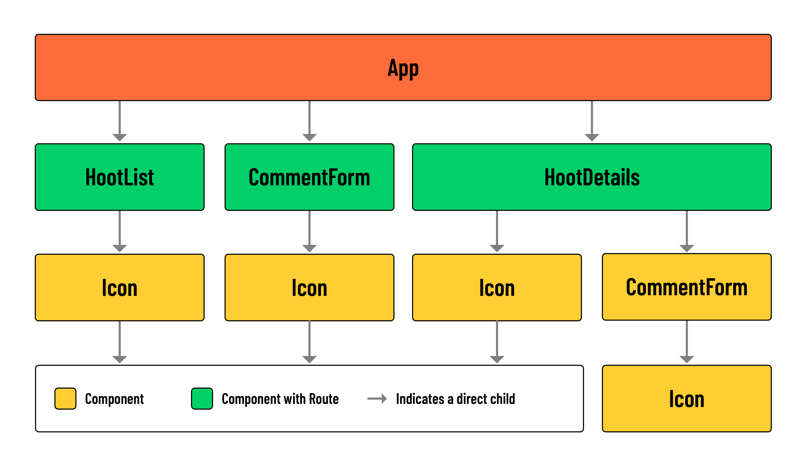

# Hoot Front-End - Build a Reusable `Icon` Component

## Overview
In this lesson, we’ll build a reusable icon component. This component should make it easier to access SVG assets across components in our app.

If you look at the `src/assets/images` directory, you’ll notice several icons. Most of these will actually be used to visually indicate the `category` of a hoot on the list page. Conditionally rendering each icon based on the value of `hoot.category` would be cumbersome. Thankfully, our `Icon` component will streamline this process.

Instead of importing the asset and building out a new `` tag, we can just provide the `Icon` component with a `category` prop. The `category` prop is just a string. The `component` uses that category string to access an `svg` value stored in the `icons` object, and renders the target `svg` as an image.

Additionally, we’ll be able to use the `Icon` component for UI elements, like ‘Delete’ buttons and ‘Edit’ links.



## Build the component
Run the following commands in your terminal:

```bash
mkdir src/components/Icon
touch src/components/Icon/Icon.jsx
```
Add the following to src/components/Icon/Icon.jsx:

```jsx
// src/components/Icon/Icon.jsx

import Add from '../../assets/images/add.svg';
import Edit from '../../assets/images/edit.svg';
import News from '../../assets/images/news.svg';
import Like from '../../assets/images/like.svg';
import Liked from '../../assets/images/liked.svg';
import Music from '../../assets/images/music.svg';
import Games from '../../assets/images/games.svg';
import Trash from '../../assets/images/trash.svg';
import Movies from '../../assets/images/movies.svg';
import Sports from '../../assets/images/sports.svg';
import Create from '../../assets/images/create.svg';
import Comments from '../../assets/images/comments.svg';
import Calendar from '../../assets/images/calendar.svg';
import Televison from '../../assets/images/television.svg';

const Icon = ({ category }) => {
  const icons = {
    Add: Add,
    News: News,
    Like: Like,
    Edit: Edit,
    Music: Music,
    Games: Games,
    Liked: Liked,
    Trash: Trash,
    Movies: Movies,
    Sports: Sports,
    Create: Create,
    Calendar: Calendar,
    Comments: Comments,
    Television: Televison,
  };

  return (
    
  );
};

export default Icon;
```

Let’s break down how this component works.

This `Icon` component dynamically selects and renders an SVG based on the provided `category` prop. Every SVG icon we’ll need in our application has been imported here and stored in an object called `icons`. Each key in the `icons` object maps to a corresponding category name.

When the component is used, it receives a `category` prop that specifies the icon to display. Using [bracket notation](https://developer.mozilla.org/en-US/docs/Web/JavaScript/Reference/Operators/Property_accessors#bracket_notation), the component *looks up* the `category` in the `icons` object and finds the associated SVG file.

This SVG file is then set as the `src` attribute of an `` element. The `alt` and `id` attributes are also dynamically set to describe the icon based on the value of the `category`.

For example, say we wanted to display the `News` SVG somewhere in our application. We would import our `<Icon>` component, add it to the return, and specify the SVG we wish to display using the `category` prop as demonstrated below:

```jsx
<Icon category='News' />
```

## Accessing SVGs with the `category` prop
Now, let’s put the `Icon` component to use.

Add the following import to the top of the `HootList` component:

```jsx
// src/components/HootList/HootList.jsx

import Icon from '../Icon/Icon';
```

Next, locate the `<h2>` containing the hoot.title:

```jsx
// src/components/HootList/HootList.jsx

<h2>{hoot.title}</h2>
```

Wrap this element in a `<div>`, and place the newly imported `<Icon />` directly beneath it:

```jsx
// src/components/HootList/HootList.jsx

<article>
  <header>

    <div>
      <h2>{hoot.title}</h2>
      <Icon />
    </div>
```

Next, we’ll need to pass a `category` down to the `<Icon />`:

```jsx
// src/components/HootList/HootList.jsx

<article>
  <header>

    <div>
      <h2>{hoot.title}</h2>
      <Icon category={hoot.category} />
    </div>
```

In your browser, navigate to the list page. For each hoot in the list, you should now have an SVG icon representing that hoot’s `category`.

## Add the `Icon` to UI elements
This component can be applied to interactive UI elements as well. Let’s use it to improve each instance of ‘Edit’ and ‘Delete’ in the `HootDetails` component. Start by importing the `Icon` component at the top of the file:

```jsx
// src/components/HootDetails/HootDetails.jsx

import Icon from '../Icon/Icon';
```

Update the ‘Edit’ and ‘Delete’ elements with the following:

```jsx
// src/components/HootDetails/HootDetails.jsx

<>
  <Link to={`/hoots/${hootId}/edit`}>
    <Icon category='Edit' />
  </Link>
  <button onClick={() => props.handleDeleteHoot(hootId)}>
    <Icon category='Trash' />
  </button>
</>
```

You’ll notice an immediate advantage to this approach - it minimizes the number of imports we need to make in each component.

Let’s make the same changes to the UI elements in our comments section:

```jsx
// src/components/HootDetails/HootDetails.jsx

<>
  <Link to={`/hoots/${hootId}/comments/${comment._id}/edit`}>
    <Icon category='Edit' />
  </Link>
  <button onClick={() => handleDeleteComment(comment._id)}>
    <Icon category='Trash' />
  </button>
</>
```

And to wrap up, head over to the `CommentForm` component.

Add the following import:

```jsx
// src/components/CommentForm/CommentForm.jsx

import Icon from '../Icon/Icon';
```

And replace the text content of the `<button>` with the `<Icon />`

```jsx
// src/components/CommentForm/CommentForm.jsx

<button type='submit'>
  <Icon category='Create' />
</button>
```

Check out the changes we made in your browser!